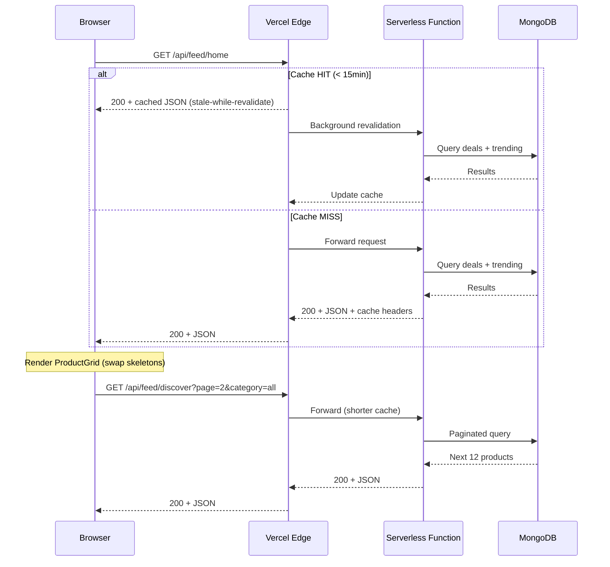

# Design Document: Content-First Homepage

## Overview

This design replaces the current marketing-style homepage (75% viewport dark hero with 1-second average session time) with a content-first product discovery feed. The architecture prioritizes immediate product visibility above the fold, skeleton-driven perceived performance, and an infinite-scroll discovery feed — all optimized for mobile-first (85% traffic) on 4G Indian connections.

The core insight: users arrive with browsing intent, not search intent. The homepage should function like a visual feed (Pinterest/Myntra Explore), not a SaaS landing page.

### Design Rationale

- **No hero section**: Products occupy the first viewport immediately below a 56px sticky header
- **Stale-while-revalidate**: Serve cached data instantly, refresh in background — critical for sub-1.5s LCP
- **Component reuse**: Extends existing `ProductCard`, `PlatformBadge`, `ProductSkeleton` with minimal API changes
- **Progressive enhancement**: Skeleton → cached data → fresh data → infinite scroll sections

## Architecture

### High-Level System Diagram

```mermaid
graph TD
    subgraph Client ["React SPA (Vite)"]
        HP[HomePage Component]
        SH[StickyHeader]
        CC[CategoryChips]
        PG[ProductGrid]
        DF[DiscoveryFeed]
        SK[SkeletonGrid]
    end

    subgraph Cache ["Vercel Edge / LRU"]
        EC[Edge Cache<br/>s-maxage=900]
        LRU[In-Memory LRU<br/>TTL 15min]
    end

    subgraph API ["Vercel Serverless"]
        FH[/api/feed/home]
        FD[/api/feed/discover]
        PD[/products/deals]
        PT[/products/trending]
        SP[/search/product]
    end

    subgraph DB ["MongoDB"]
        Products[(Products Collection)]
        Deals[(Deals/PriceDrops)]
    end

    HP --> SH
    HP --> CC
    HP --> PG
    HP --> DF
    HP --> SK

    PG -->|initial load| FH
    DF -->|scroll pagination| FD
    CC -->|category filter| SP

    FH --> EC
    EC -->|MISS| LRU
    LRU -->|MISS| PD
    LRU -->|MISS| PT
    PD --> Products
    PT --> Deals

    FD --> LRU
    FD --> Products
```

### Data Flow Sequence



## Components and Interfaces

### Component Tree

```
HomePage (new)
├── StickyHeader (new — replaces SiteNav on homepage)
│   ├── Logo (existing)
│   ├── SearchInput (new — inline expandable)
│   └── UserActions (wishlist icon, account icon)
├── CategoryChips (new)
├── ProductGrid (enhanced — uses existing ProductCard)
│   ├── ProductCard (existing — extended with Savings_Label)
│   └── ProductSkeleton (existing — reused)
├── DiscoveryFeed (new)
│   ├── FeedSection (new — titled groups)
│   │   └── ProductCard[]
│   └── InfiniteScrollTrigger (new)
├── GeoBanner (new — dismissible)
└── BackToTopButton (new)
```

### Component Interfaces (TypeScript)

```typescript
// ─── StickyHeader ───────────────────────────────────────────────────────────

interface StickyHeaderProps {
  onSearch: (query: string) => void;
  className?: string;
}

// Height: 56px mobile, 64px desktop
// Background: bg-white/80 backdrop-blur-lg border-b border-neutral-100
// Contains: Logo (left), SearchInput (center), UserActions (right)

// ─── CategoryChips ──────────────────────────────────────────────────────────

interface CategoryChipsProps {
  categories: CategoryItem[];
  activeCategory: string;
  onSelect: (category: string) => void;
}

interface CategoryItem {
  id: string;       // e.g. "kurta-sets"
  label: string;    // e.g. "Kurta Sets"
  query: string;    // Search query to execute
}

// ─── ProductGrid (Initial Above-The-Fold) ───────────────────────────────────

interface HomeProductGridProps {
  products: HomeFeedProduct[];
  loading: boolean;
  columns?: 2 | 3 | 4; // Responsive default: 2 mobile, 3 tablet, 4 desktop
}

interface HomeFeedProduct {
  id: string;
  title: string;
  brand?: string;
  imageUrl?: string;
  price: number;
  originalPrice?: number;
  discount: number;        // Pre-computed percentage
  savings?: number;        // Absolute INR savings
  platform: string;
  url?: string;
}

// ─── DiscoveryFeed ──────────────────────────────────────────────────────────

interface DiscoveryFeedProps {
  initialCategory: string;
}

interface FeedSection {
  id: string;
  title: string;            // "Today's Deals", "Under ₹999", etc.
  products: HomeFeedProduct[];
}

interface FeedState {
  sections: FeedSection[];
  page: number;
  hasMore: boolean;
  loading: boolean;
}

// ─── GeoBanner ──────────────────────────────────────────────────────────────

interface GeoBannerProps {
  countryCode: string | null;
  onDismiss: () => void;
}

// ─── BackToTopButton ────────────────────────────────────────────────────────

interface BackToTopButtonProps {
  showAfterPx?: number; // Default: 800
}
```

### New API Endpoints

```typescript
// ─── GET /api/feed/home ─────────────────────────────────────────────────────
// Returns the initial above-the-fold products (8-12 items)
// Cache: s-maxage=900, stale-while-revalidate=1800

interface HomeFeedResponse {
  products: HomeFeedProduct[];
  source: 'deals' | 'trending' | 'seed'; // For analytics
  cachedAt: string;                       // ISO timestamp
}

// ─── GET /api/feed/discover ─────────────────────────────────────────────────
// Returns paginated discovery sections
// Query params: page (1-5), category (optional)
// Cache: s-maxage=300, stale-while-revalidate=600

interface DiscoverFeedResponse {
  sections: FeedSection[];
  page: number;
  hasMore: boolean;
  totalPages: number; // Max 5
}
```

### Custom Hooks

```typescript
// ─── useHomeFeed ────────────────────────────────────────────────────────────

function useHomeFeed(category: string): {
  products: HomeFeedProduct[];
  loading: boolean;
  source: 'deals' | 'trending' | 'seed';
  error: Error | null;
}

// Fetches /api/feed/home with category param
// Falls back to SEED_PRODUCTS after 5s timeout
// Uses AbortController for cleanup

// ─── useDiscoveryFeed ───────────────────────────────────────────────────────

function useDiscoveryFeed(category: string): {
  sections: FeedSection[];
  loading: boolean;
  hasMore: boolean;
  loadNext: () => void;
}

// Triggered by IntersectionObserver (200px threshold)
// Caps at 5 pages (60 additional products)
// Appends sections on scroll

// ─── useGeoRegion ───────────────────────────────────────────────────────────

function useGeoRegion(): {
  countryCode: string | null;
  isIndia: boolean;
  dismissed: boolean;
  dismiss: () => void;
}

// Reads x-vercel-ip-country from meta tag injected by edge middleware
// Falls back to navigator.language / Accept-Language heuristic
// Persists dismissal in localStorage key: "tagcheck_geo_dismissed"
```

## Data Models

### HomeFeedProduct (Client-Side DTO)

```typescript
interface HomeFeedProduct {
  id: string;
  title: string;
  brand?: string;
  imageUrl?: string;
  price: number;           // Lowest current price in INR
  originalPrice?: number;  // MRP / highest historical price
  discount: number;        // Pre-computed: Math.round((original - price) / original * 100)
  savings?: number;        // Absolute: originalPrice - price (only if > 200)
  platform: string;        // Source platform with lowest price
  url?: string;            // Deep link to platform listing
  category?: string;       // For filtering
}
```

### API Cache Strategy (Server-Side)

```typescript
// In-memory LRU cache (api/_lib/cache.ts)
interface CacheEntry<T> {
  data: T;
  timestamp: number;       // Date.now() when cached
  ttl: number;             // Milliseconds
}

// Cache configuration
const CACHE_CONFIG = {
  homeFeed: { ttl: 15 * 60 * 1000, maxEntries: 10 },     // 15 min
  discoverFeed: { ttl: 5 * 60 * 1000, maxEntries: 50 },  // 5 min
} as const;
```

### Mapping from Existing Models

The `HomeFeedProduct` is derived from either:
1. **DealApiItem** (from `/products/deals`) → uses `mapDealApiToDealData` with added `savings` field
2. **TrendingApiItem** (from `/products/trending`) → uses `mapTrendingApiToDealData`
3. **SeedProduct** (static fallback) → flattened to lowest-price platform entry

```typescript
// New mapper: api/_lib/mappers/homeFeed.ts
function mapSeedToHomeFeed(seed: SeedProduct): HomeFeedProduct {
  const cheapest = seed.platforms.reduce((min, p) => p.price < min.price ? p : min);
  const mostExpensive = seed.platforms.reduce((max, p) => p.originalPrice > max.originalPrice ? p : max);
  const savings = mostExpensive.originalPrice - cheapest.price;

  return {
    id: `seed_${seed.title.toLowerCase().replace(/\s+/g, '_').slice(0, 32)}`,
    title: seed.title,
    brand: seed.brand,
    imageUrl: seed.imageUrl,
    price: cheapest.price,
    originalPrice: mostExpensive.originalPrice,
    discount: Math.round(((mostExpensive.originalPrice - cheapest.price) / mostExpensive.originalPrice) * 100),
    savings: savings > 200 ? savings : undefined,
    platform: cheapest.platform,
    url: cheapest.url,
    category: seed.category,
  };
}
```

### HTTP Cache Headers (Vercel)

```typescript
// /api/feed/home handler
res.setHeader('Cache-Control', 's-maxage=900, stale-while-revalidate=1800');

// /api/feed/discover handler
res.setHeader('Cache-Control', 's-maxage=300, stale-while-revalidate=600');
```

### Geo Detection (Edge Middleware)

```typescript
// middleware.ts (Vercel Edge Middleware)
// Injects country code into response header for client consumption
import { NextResponse } from 'next/server'; // Vercel edge runtime

export function middleware(request: Request) {
  const country = request.headers.get('x-vercel-ip-country') || 'IN';
  const response = NextResponse.next();
  response.headers.set('x-user-country', country);
  return response;
}
```

Since this is a Vite SPA (not Next.js), geo detection is handled by the API:
```typescript
// /api/feed/home also returns geo info
interface HomeFeedResponse {
  products: HomeFeedProduct[];
  source: 'deals' | 'trending' | 'seed';
  cachedAt: string;
  geo: {
    country: string;  // From x-vercel-ip-country header on the API request
    isIndia: boolean;
  };
}
```

## Correctness Properties

*A property is a characteristic or behavior that should hold true across all valid executions of a system — essentially, a formal statement about what the system should do. Properties serve as the bridge between human-readable specifications and machine-verifiable correctness guarantees.*

### Property 1: Discount and Savings Calculation Correctness

*For any* pair of positive numbers `(originalPrice, price)` where `originalPrice > price`, the computed discount must equal `Math.round((originalPrice - price) / originalPrice * 100)`, and the savings label must appear if and only if `originalPrice - price > 200` with value equal to `originalPrice - price`.

**Validates: Requirements 3.2, 3.3**

### Property 2: Category Filter Consistency

*For any* selected category (other than "All") and any product dataset, filtering the dataset by category must return only products whose `category` field matches the selected category's query term. The filtered result must be a subset of the original dataset.

**Validates: Requirements 4.4, 4.5**

### Property 3: Price Formatting Round Trip

*For any* positive finite number `n`, `formatPrice(n)` must produce a string starting with "₹" followed by a valid Indian number format, and parsing that formatted string back (stripping "₹" and commas) must yield `Math.round(n)`.

**Validates: Requirements 3.1, 9.3**

### Property 4: Seed Data Fallback Completeness

*For any* `SeedProduct` in the seed data array, `mapSeedToHomeFeed(seed)` must produce a valid `HomeFeedProduct` with all required fields (`id`, `title`, `price`, `platform`, `discount`) populated, `price > 0`, and `discount` between 0 and 100 inclusive.

**Validates: Requirements 2.6, 5.6**

### Property 5: Infinite Scroll Pagination Bounds

*For any* sequence of `loadNext()` calls (regardless of count or timing), the total number of loaded pages must never exceed 5, and the cumulative additional product count must never exceed 60.

**Validates: Requirements 6.5**

### Property 6: Deals Sorted by Descending Discount

*For any* non-empty array of deal products rendered in the ProductGrid, for every adjacent pair `(products[i], products[i+1])`, it must hold that `products[i].discount >= products[i+1].discount`.

**Validates: Requirements 2.4**

### Property 7: Grid Item Count Meets Viewport Minimums

*For any* viewport width, the number of initial grid items (skeletons during load, cards after load) must be at least 6 when width < 640px (mobile) and at least 8 when width >= 640px (desktop).

**Validates: Requirements 2.1, 5.5**

### Property 8: Image Loading Strategy by Position

*For any* product at index `i` in the rendered grid, if `i` is within the above-fold threshold (first `columns * visible_rows` items), the image must have `loading="eager"`; all other images must have `loading="lazy"`.

**Validates: Requirements 8.3, 8.5**

## Error Handling

| Scenario | Behavior | User Impact |
|----------|----------|-------------|
| `/api/feed/home` fails | Serve stale cache; if no cache, render seed products | Zero — seamless fallback |
| `/api/feed/home` timeout (>5s) | Cancel request, render seed products, retry in background | Minimal — sees real products instantly |
| `/api/feed/discover` fails | Show "Something went wrong" inline with retry button | Low — initial grid still visible |
| Invalid product image URL | Show fallback placeholder (🛍️ icon + brand name) | Graceful — existing pattern in `ProductCard` |
| Geo detection unavailable | Default to India (`isIndia: true`) | None — majority case |
| `localStorage` unavailable (private browsing) | Geo banner shows on every visit; no crash | Minor repetition |
| Network offline during scroll | Intersection observer pauses; resume on reconnect | Feed stops growing, no error |

### Error Boundary Strategy

```typescript
// Wrap DiscoveryFeed in an ErrorBoundary that:
// 1. Catches render errors in feed sections
// 2. Displays a "refresh this section" prompt
// 3. Does NOT crash the entire homepage

// The ProductGrid (above the fold) has its own error handling:
// API error → seed fallback → never shows an error state to users
```

## Testing Strategy

### Unit Tests (Vitest)

- **formatPrice** — edge cases: 0, negative, NaN, very large numbers, decimals
- **calculateDiscount** — boundary: equal prices, zero original, negative values
- **mapSeedToHomeFeed** — validates all seed products produce valid DTOs
- **mapDealApiToDealData** — ensures field mapping correctness
- **Category filtering logic** — "All" returns unfiltered, specific category filters correctly
- **Geo detection heuristic** — Accept-Language parsing, fallback behavior
- **StickyHeader height** — renders at correct height per breakpoint
- **ProductCard navigation** — tap navigates to compare page with correct query

### Property-Based Tests (fast-check)

Each property test runs a minimum of 100 iterations with randomized inputs.

| Property | Test Description | Tag |
|----------|-----------------|-----|
| 1 | Generate random (originalPrice, price) pairs; verify discount % and savings label logic | `Feature: content-first-homepage, Property 1: Discount and Savings Calculation Correctness` |
| 2 | Generate random product arrays and category selections; verify filter returns only matching items | `Feature: content-first-homepage, Property 2: Category Filter Consistency` |
| 3 | Generate random positive numbers; verify formatPrice round-trip preserves value | `Feature: content-first-homepage, Property 3: Price Formatting Round Trip` |
| 4 | Feed all SeedProduct entries through mapSeedToHomeFeed; verify valid output | `Feature: content-first-homepage, Property 4: Seed Data Fallback Completeness` |
| 5 | Generate random sequences of loadNext() calls (1-100); verify page cap at 5, product cap at 60 | `Feature: content-first-homepage, Property 5: Infinite Scroll Pagination Bounds` |
| 6 | Generate random deal arrays; verify output is sorted by descending discount | `Feature: content-first-homepage, Property 6: Deals Sorted by Descending Discount` |
| 7 | Generate random viewport widths (320-1920px); verify skeleton count meets minimums | `Feature: content-first-homepage, Property 7: Grid Item Count Meets Viewport Minimums` |
| 8 | Generate random product lists and viewport configs; verify eager/lazy loading by position | `Feature: content-first-homepage, Property 8: Image Loading Strategy by Position` |

**PBT Configuration:**
- Library: `fast-check` (TypeScript-native, integrates with Vitest)
- Minimum iterations: 100 per property
- Each test tagged with design property reference in a comment block
- Test file: `tests/properties/contentFirstHomepage.prop.ts`

### Integration Tests

- Homepage renders with mocked API returning deals → shows deal products sorted by discount
- Homepage renders with empty deals API → falls back to trending
- Homepage renders with both APIs failing → shows seed products within 5s
- Infinite scroll triggers after scrolling to bottom → appends sections (max 5 pages)
- Category chip selection → filters products, "All" shows unfiltered
- Geo banner appears for non-India users, dismisses and persists in localStorage
- Stale-while-revalidate: stale data served immediately, background refresh occurs

### Performance Testing

- Lighthouse CI check: LCP < 1.5s on simulated 4G (1.6Mbps, 150ms RTT)
- Bundle size check: homepage route < 120KB gzipped (excluding shared vendor chunks)
- Image preload verification: first 8 product images use `<link rel="preload">`
- Total Blocking Time (TBT): < 200ms on 4G simulation
